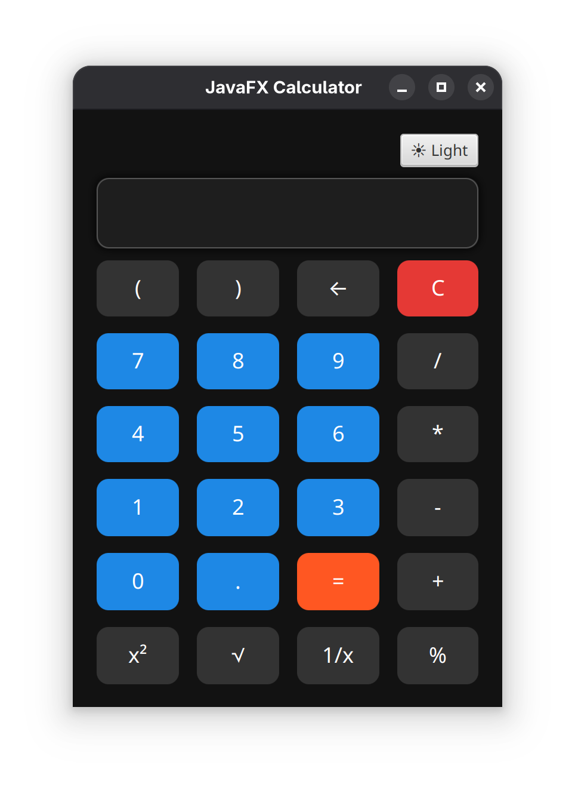
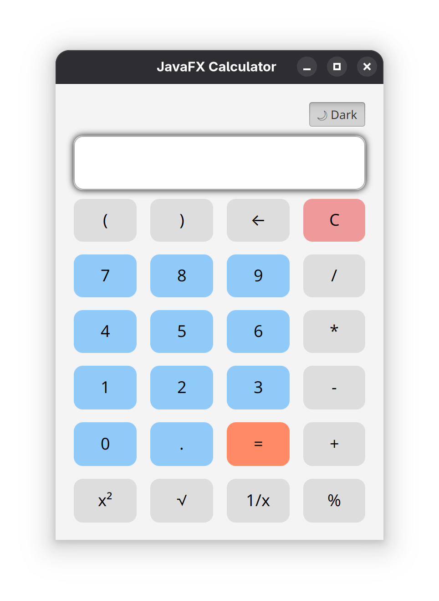

# 🖩 JavaFX Calculator

[](https://www.oracle.com/java/)  
[](https://openjfx.io/)  
[](LICENSE)

A **simple & interactive calculator** built using **JavaFX**. Perform basic arithmetic operations with a clean GUI! ✨

---

## Features ✅

- ➕ Addition
- ➖ Subtraction
- ✖️ Multiplication
- ➗ Division
- 🧹 Clear (C) button
- 🖱️ Clickable buttons for numbers and operations
- ⚠️ Handles errors like division by zero

---

## Screenshots 📸


<table>
  <tr>
    <td></td>
    <td></td>
  </tr>
</table>


---

## Technologies Used 🛠️

- **Java** (JDK 8+)
- **JavaFX** for GUI
- **IntelliJ IDEA** (recommended)

---

## Installation 💻

1. Clone the repo:

```bash
git clone https://github.com/ayush-techx/JavaFX-Calculator.git
